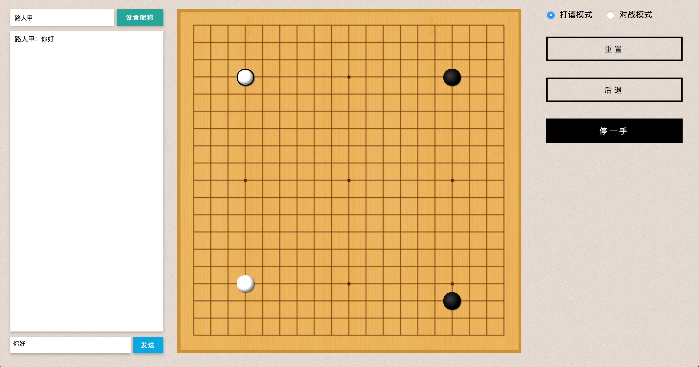
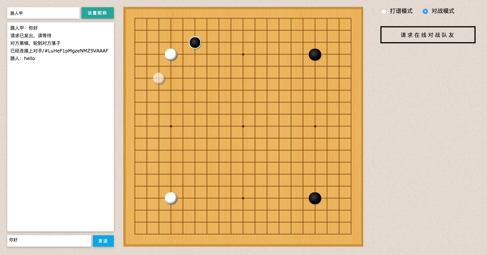

#### Run:

```
$npm install
$npm start
```


#### Web version:

https://github.com/IreneZhou/Weiqi-Platform/tree/master


#### Technologies:

`Electron`  `Node.js`  `Socket.io`  `HTML`  `CSS`  `JavaScript` `Express`


#### TODO:

1.  Pass
2.  Resign
3.  Signup/login (name, email, level)
4.  Create rooms